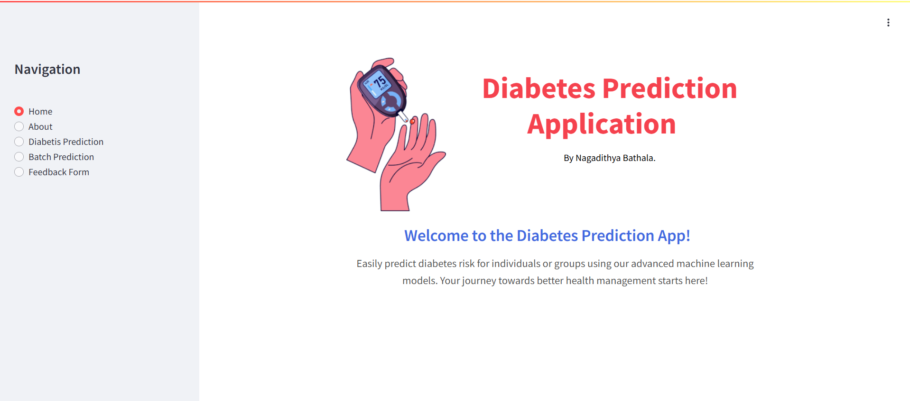

# Diabetes Prediction Application



## Access the Application
You can access the deployed application here: [Diabetes Prediction App]([https://diabetes-predictor-gcp.com](https://diabetes-app-streamlit-frontend-825592727774.europe-west2.run.app))

## Project Description
This project uses a machine learning model to predict diabetes risk based on user-provided input features. The application includes a user-friendly interface built with Streamlit, offering individual and batch prediction options, feature importance visualization, and a feedback mechanism. The entire application, including the machine learning model, API, and Streamlit front-end, is deployed on Google Cloud Platform (GCP).

## Overview
The **Diabetes Prediction Application** combines machine learning, Streamlit for front-end development, and GCP cloud services for back-end hosting and database integration. Key features include:
1. **Individual Prediction**: Users can input features to get real-time predictions of diabetes risk.
2. **Batch Prediction**: Users can upload a CSV file for batch predictions and download the results.
3. **Feature Importance**: Displays the contribution of each feature in determining predictions.
4. **Feedback Form**: Allows users to provide feedback, stored in a PostgreSQL database hosted on GCP.
5. **API Integration**: The application interacts with a custom API hosted on GCP to fetch predictions.

## Deployment on GCP
1. **API**:
   - A FastAPI-based backend is deployed on GCP.
   - It is the intermediary between the machine learning model and the Streamlit front-end.
   - The API handles prediction requests for both individual and batch inputs.
2. **Streamlit Application**:
   - The front end is deployed on GCP to ensure global accessibility.
   - The application uses the API to fetch predictions dynamically.
3. **Database**:
   - Feedback data is stored in a PostgreSQL database hosted on GCP.
   - The database is securely accessed via environment variables.

## Project Structure
- **Machine Learning Model**:
  - Trained using Python and exported it for deployment.
  - Handles both individual and batch predictions.
- **Streamlit Front-End**:
  - Four pages: Home, Diabetes Prediction, Batch Prediction, and Feedback Form.
  - Interactive components for user input, file uploads, and real-time predictions.
- **GCP Integration**:
  - API for prediction services, Streamlit app deployment, and a PostgreSQL database for feedback storage.

## Project Files
- **diabetes.csv**: The dataset containing attributes of diabetes such as glucose levels, insulin levels, BMI, age, and more.
- **Diabetes_Prediction_Model_Training.ipynb**: Notebook containing the training and evaluation of the machine learning model.
- **FastAPI_GetResult.py**: Contains FastAPI code for handling prediction requests
- **Streamlit_App.py**: Streamlit code for the web application interface.
- **requirements.txt**: Dependencies required to run the application.
- **README.md**: Deployment instructions for GCP.

## Features and Pages
1. **Home**: Introduction to the app with a user-friendly interface.
2. **Diabetes Prediction**:
   - Users input individual features.
   - Real-time prediction (diabetic or non-diabetic).
   - The feature importance plot shows the contribution of each feature.
3. **Batch Prediction**:
   - Users upload a CSV file with multiple patient records.
   - Model processes the data and provides predictions.
   - Results can be downloaded as a CSV file.
4. **Feedback Form**:
   - Users provide feedback with their name and email.
   - Feedback is saved to a PostgreSQL database hosted on GCP.

## Dependencies
The following Python libraries are required:
- `streamlit`
- `numpy`
- `pandas`
- `matplotlib`
- `requests`
- `psycopg2`
- `dotenv`
- `fastapi`
- `uvicorn`

Install dependencies with:
```bash
pip install -r requirements.txt
```

## Results
- **Individual Prediction**: Provides binary output (diabetic or non-diabetic) and feature importance visualization.
- **Batch Prediction**: Processes multiple patient records and generates predictions in CSV format.
- **Feedback Mechanism**: Feedback data is stored securely in a PostgreSQL database hosted on GCP.

## GCP Integration
- **API Deployment**: The FastAPI backend is deployed on GCP for handling prediction requests.
- **Streamlit Deployment**: The web application is hosted on GCP for global accessibility.
- **Database Hosting**: Feedback is stored in a PostgreSQL database managed on GCP.

## Conclusion
This project demonstrates the integration of machine learning, cloud deployment, and web development to create a fully functional diabetes prediction application. By leveraging GCP for hosting and API integration, the app ensures scalability, accessibility, and performance.

## Contributing
Contributions are welcome! If you find any issues or want to improve the code, feel free to open a pull request or create an issue in the repository.

## License
This project is licensed under the [MIT License](./LICENSE). See the LICENSE file for more details.
